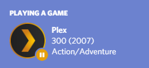
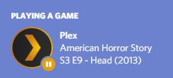

# Discord Rich Presence for Plex using Node.js

This is still project is still **currently under development**. The project has only been tested on Windows 10 with the Plex Desktop app. Due to how the Plex activity is currently checked, the Plex desktop app is required to be opened. 

### Examples

   


### Usage

After cloning the repo, you will be required to edit and rename the `template.env` file to `.env`
You will only be required to fill in the parameters for your Plex account.

- Create a discord client ID at [discord.com/developers](https://discord.com/developers/)
- You can find your Plex token by [following this guide](https://support.plex.tv/articles/204059436-finding-an-authentication-token-x-plex-token/)
```
## Discord
CLIENT_ID=409127705980829707

## Plex
PLEX_SERVER=
PLEX_SERVERNAME=
PLEX_PORT=32400
PLEX_TOKEN=
PLEX_USERNAME=
PLEX_PASSWORD=
```

You can start using the following command

```
cd node-rpc-plex
npm install
npm run start
```

or using either the `rpc.bat` or `rpc.sh` file. There is also a provided `startPlex.bat` which will open the `rpc.bat` file and then open Plex.


### To do List

- [ ] Check combability on Linux and OSX devices
- [ ] Test for other categories other than Movies/TV
- [ ] Fix elapsed time to run according to the elapsed time of what you are currently watching
- [ ] Fix error when you close Plex where the application ID is null
